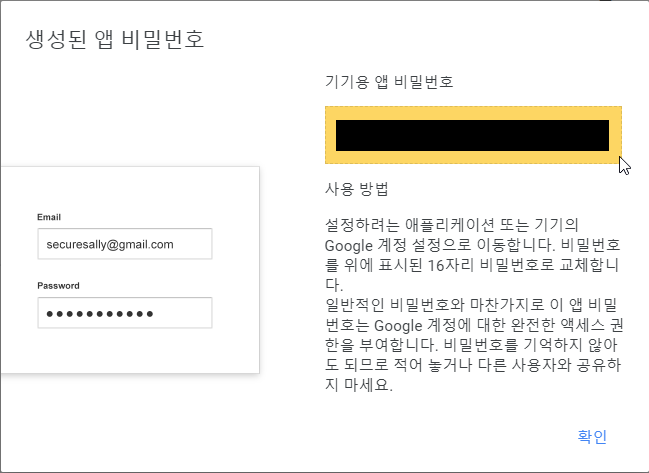

# 설명

이메일 전송 기능을 제공하는 Thing 예제.

# 의존성

- Gmail

  1. [링크](https://myaccount.google.com/security)에 접속하여 **2단계 인증**을 클릭하여 **앱 비밀번호**를 설정.
  2. **기타**를 선택하여 앱 비밀번호 생성.

     

  3. 생성된 앱 비밀번호를 복사 또는 저장해두기.

     

  4. 생성된 앱 비밀번호를 [secret.py](http://secret.py/) 파일의 `SENDER_EMAIL`, `SENDER_PASSWORD`을 원하는 송신자 이메일, 2차 비밀번호로 설정.

     ```bash
     SENDER_EMAIL = 'xxxx@gmail.com'
     EMAIL_PASSWORD_GMAIL = 'xxxx'
     ```

  5. [run.py](http://run.py/)의 `SENDER_EMAIL`을 자신의 gmail 주소로 설정.

# 실행

```bash
cd big_thing/email_big_thing
python run.py
```

# 옵션

- `-n, --name | default = None`

  Thing의 이름. 이 이름은 Thing을 구분하기 위한 ID이기도 하다.

- `-ip --host | default='127.0.0.1'`

  Thing의 ip 주소.

- `-p, --port | default=1883`

  Thing의 port 번호.

- `-ac, --alive_cycle | default=60`

  Thing의 alive 패킷 전송 주기. alive 패킷을 통해 Middleware가 Thing의 활성화 여부를 파악한다.

- `-as, --auto_scan | default=True`

  Middleware 자동스캔 기능 활성화 여부.

- `--log | default=True`

  Thing의 log기능의 활성화 여부.

# Services

## Function Services

- `send(receive_address:str, title:str, text: str) -> bool`

  제목(`title`), 본문(`text`)의 내용으로 이메일을 `receive_address`로 전송하는 서비스.

- `send_with_file(receive_address:str, title:str, text: str, file_path: str) -> bool`

  제목(`title`), 본문(`text`), 파일(`file`)의 내용으로 이메일을 `receive_address`로 전송하는 서비스.

## Value Services

- (없음)
